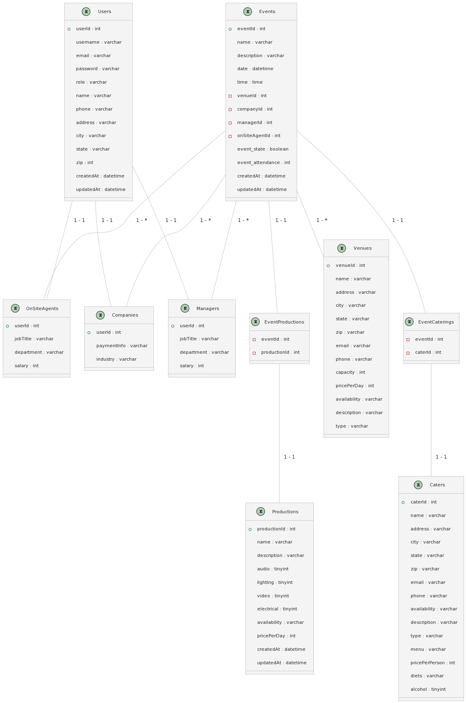

# Event Management App

This event management app is designed to help users create and manage events, select venues, and coordinate catering and production services. The app includes features for user management, event creation, venue selection, and service provider selection.
Features

User Management: The app includes a User entity that can be either an Employee or a Client. Clients can create and manage events, while Employees can perform aditional administrative tasks such as approving events and managing service providers.

Event Creation: The app allows clients to create and manage events, including selecting the date, time, location, and other details. Clients can also specify catering and production needs for each event.

Venue Selection: The app includes a Venues entity that provides information about various event venues, including their address, capacity, availability, rental fee, amenities, parking, rating, and restrictions. Clients can select a venue that meets their needs and preferences.

Catering and Production Services: The app includes entities for Catering and Production providers, each with information about their offered services, equipment inventory, portfolios, ratings, and price ranges. Clients can select one or more providers to meet their catering and production needs for each event.

## ER Diagram

The ER diagram for the app includes entities for Users, Employees, Clients, Events, Venues, Catering providers, and Production providers. The relationships between these entities are managed through foreign key relationships.

Click here to see ER Diagram

## Technologies Used

The app is built using the following technologies and frameworks:

- React.Js
- Node.js
- Express.js
- MySql
- Sequelize

## Usage

This app is hosted at [events.joshygarcia.com](http://events.joshygarcia.com).

### Getting Started

1. Navigate to [events.joshygarcia.com](http://events.joshygarcia.com).
2. Click on the 'Register' button and provide the necessary information.
3. You will be redirected to the dashboard once you successfully register.

### Features

Once logged in, you can:

- **View Upcoming Events and Tasks:** On the dashboard, you'll find a list of all upcoming events and tasks.

- **View All Your Events** Click the 'Events' tab on the sidebar to see all the events that you have permission to see.

  - **See an Events Details** Click on any event on the events page to see the details of the event.

- **Create an Event:** Use the 'Create Event' button to schedule a new event. You can add a name, date, time, venue, and more.

- **Modify Your User Info:** Click on 'Profile' tab on the sidebar to view and edit your user information. Here, you can update your email address, change your password, and address.

### Troubleshooting and Support

If you encounter any issues while using the app or have any questions, feel free to contact us at [events@joshygarcia.com](mailto:events@joshygarcia.com).

## Contributors

This app was developed by the following contributors:

- Joshy Garcia
- Gadiel Rodriguez
- Gabriela Gonzales
- Allan Alvarez
- Salaamah Ahmad
- David Andrade
- Malik Alaka Yusuf

If you have any feedback or suggestions, please feel free to contact us at [events@joshygarcia.com](mailto:events@joshygarcia.com). Your input is greatly appreciated and will help us improve our application. Thank you for your support!
